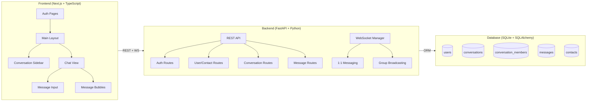
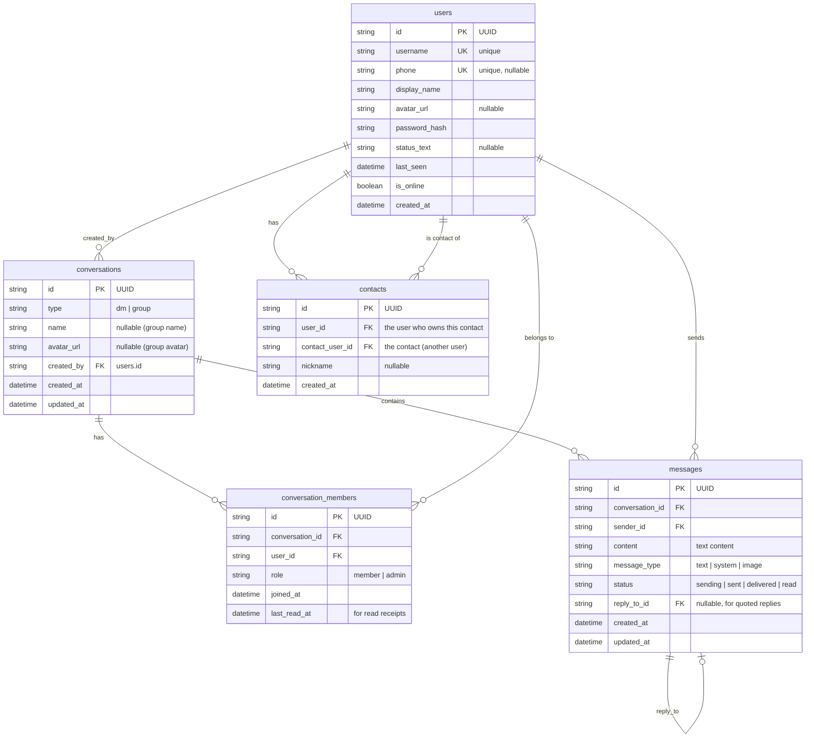

# Signal Messaging Clone — Implementation Plan

## Overview

Build a full-stack Signal messaging clone with **Next.js (TypeScript) + Tailwind CSS** frontend, **FastAPI (Python)** backend, **SQLite** database, and **WebSocket** real-time messaging. The app will visually and functionally replicate Signal's desktop experience: clean two-pane layout, real-time 1:1 and group chat, mocked auth with OTP, and a seeded database for immediate usability.

---

## Architecture



---

## Database Schema



**Indexes** (for performance):
- `messages(conversation_id, created_at)` — fast message retrieval per conversation, sorted by time
- `messages(sender_id)` — sender lookups
- `conversation_members(user_id)` — quickly find all conversations for a user
- `conversation_members(conversation_id)` — quickly find all members of a conversation
- `contacts(user_id)` — fast contact list retrieval
- `users(username)` — login lookups

---

## Project Structure

```
signal-clone/
├── frontend/                    # Next.js app
│   ├── src/
│   │   ├── app/
│   │   │   ├── layout.tsx           # Root layout
│   │   │   ├── page.tsx             # Redirect to /chat or /auth
│   │   │   ├── auth/
│   │   │   │   ├── page.tsx         # Phone/username registration
│   │   │   │   ├── verify/page.tsx  # OTP verification
│   │   │   │   └── profile/page.tsx # Display name + avatar setup
│   │   │   └── chat/
│   │   │       ├── layout.tsx       # Two-pane layout (sidebar + chat)
│   │   │       ├── page.tsx         # Empty state ("Select a chat")
│   │   │       └── [conversationId]/
│   │   │           └── page.tsx     # Active chat view
│   │   ├── components/
│   │   │   ├── auth/
│   │   │   │   ├── PhoneInput.tsx
│   │   │   │   ├── OTPInput.tsx
│   │   │   │   └── ProfileSetup.tsx
│   │   │   ├── sidebar/
│   │   │   │   ├── Sidebar.tsx
│   │   │   │   ├── ConversationList.tsx
│   │   │   │   ├── ConversationItem.tsx
│   │   │   │   ├── SearchBar.tsx
│   │   │   │   └── SidebarHeader.tsx
│   │   │   ├── chat/
│   │   │   │   ├── ChatHeader.tsx
│   │   │   │   ├── MessageList.tsx
│   │   │   │   ├── MessageBubble.tsx
│   │   │   │   ├── MessageInput.tsx
│   │   │   │   ├── TypingIndicator.tsx
│   │   │   │   └── MessageStatus.tsx
│   │   │   ├── groups/
│   │   │   │   ├── CreateGroupModal.tsx
│   │   │   │   ├── GroupInfoPanel.tsx
│   │   │   │   └── MemberList.tsx
│   │   │   ├── contacts/
│   │   │   │   ├── AddContactModal.tsx
│   │   │   │   └── ContactList.tsx
│   │   │   ├── settings/
│   │   │   │   └── SettingsPanel.tsx
│   │   │   └── ui/
│   │   │       ├── Avatar.tsx
│   │   │       ├── Modal.tsx
│   │   │       ├── Toast.tsx
│   │   │       └── Spinner.tsx
│   │   ├── hooks/
│   │   │   ├── useWebSocket.ts
│   │   │   ├── useAuth.ts
│   │   │   └── useDebounce.ts
│   │   ├── store/
│   │   │   ├── authStore.ts        # Zustand: auth state
│   │   │   ├── chatStore.ts        # Zustand: conversations, messages
│   │   │   └── uiStore.ts         # Zustand: modals, toasts, panels
│   │   ├── lib/
│   │   │   ├── api.ts              # Axios/fetch wrapper for REST
│   │   │   ├── websocket.ts        # WebSocket client singleton
│   │   │   └── utils.ts            # Formatters, helpers
│   │   └── types/
│   │       └── index.ts            # Shared TypeScript interfaces
│   ├── public/
│   │   └── signal-logo.svg
│   ├── tailwind.config.ts
│   ├── next.config.ts
│   ├── tsconfig.json
│   └── package.json
│
├── backend/                     # FastAPI app
│   ├── app/
│   │   ├── main.py              # FastAPI app entry, CORS, lifespan
│   │   ├── config.py            # Settings (SECRET_KEY, DB path, etc.)
│   │   ├── database.py          # SQLAlchemy engine, session, Base
│   │   ├── models/
│   │   │   ├── __init__.py
│   │   │   ├── user.py
│   │   │   ├── conversation.py
│   │   │   ├── message.py
│   │   │   └── contact.py
│   │   ├── schemas/
│   │   │   ├── __init__.py
│   │   │   ├── user.py
│   │   │   ├── conversation.py
│   │   │   ├── message.py
│   │   │   └── contact.py
│   │   ├── routers/
│   │   │   ├── __init__.py
│   │   │   ├── auth.py
│   │   │   ├── users.py
│   │   │   ├── conversations.py
│   │   │   ├── messages.py
│   │   │   └── contacts.py
│   │   ├── services/
│   │   │   ├── __init__.py
│   │   │   ├── auth_service.py
│   │   │   ├── conversation_service.py
│   │   │   └── message_service.py
│   │   ├── websocket/
│   │   │   ├── __init__.py
│   │   │   ├── manager.py       # ConnectionManager class
│   │   │   └── handlers.py      # Message routing & event handling
│   │   └── middleware/
│   │       └── auth.py          # JWT dependency injection
│   ├── seed.py                  # Database seeding script
│   ├── requirements.txt
│   └── README.md
│
└── README.md                    # Project-level docs
```

---

## Phase 1: Project Setup & Database Schema

**Goal**: Scaffold both projects, configure the database, and establish the full schema with seed data.

### Backend

| File | Description |
|------|-------------|
| `backend/requirements.txt` | `fastapi`, `uvicorn[standard]`, `sqlalchemy`, `pydantic`, `python-jose[cryptography]`, `passlib[bcrypt]`, `python-multipart`, `aiosqlite` |
| `backend/app/config.py` | App settings: `SECRET_KEY`, `DATABASE_URL` (sqlite), `OTP_CODE = "123456"`, `ACCESS_TOKEN_EXPIRE_MINUTES` |
| `backend/app/database.py` | SQLAlchemy async engine, `SessionLocal`, `Base` declarative base, `get_db` dependency |
| `backend/app/models/*.py` | All ORM models: `User`, `Conversation`, `ConversationMember`, `Message`, `Contact` with relationships, indexes |
| `backend/app/main.py` | FastAPI app with `lifespan` event to create tables on startup, CORS middleware |
| `backend/seed.py` | Seed script: creates 6 users, 4 DM conversations, 2 group conversations, ~50 messages across them |

### Frontend

| File | Description |
|------|-------------|
| `frontend/` | Initialize with `npx -y create-next-app@latest ./` (TypeScript, Tailwind CSS, App Router, ESLint) |
| `frontend/tailwind.config.ts` | Signal-accurate color palette: `signal-blue: #3A76F0`, `signal-bg: #FFFFFF` / dark variants, chat bubble colors |
| `frontend/src/app/globals.css` | Tailwind directives + base Signal typography (system fonts: `-apple-system, BlinkMacSystemFont, 'Segoe UI'`), scrollbar styling |
| `frontend/src/types/index.ts` | All shared TypeScript interfaces (`User`, `Conversation`, `Message`, etc.) |

### Testing Before Next Phase
- [ ] `cd backend && python -m app.main` starts without errors
- [ ] Tables are auto-created in `signal.db`
- [ ] `python seed.py` populates database — verify with `sqlite3 signal.db "SELECT * FROM users;"` (6 users visible)
- [ ] `cd frontend && npm run dev` serves at `localhost:3000` without errors

---

## Phase 2: Authentication & Core UI Shell

**Goal**: Implement mocked auth (register → OTP → profile setup → login), JWT sessions, and build the two-pane layout shell.

### Backend — Auth API

| File | Description |
|------|-------------|
| `backend/app/schemas/user.py` | `RegisterRequest(username, phone)`, `VerifyOTPRequest(username, otp)`, `LoginRequest`, `ProfileUpdate`, `TokenResponse` |
| `backend/app/routers/auth.py` | `POST /api/auth/register` — store user with pending status. `POST /api/auth/verify-otp` — accept fixed OTP `123456`, return JWT. `POST /api/auth/login` — credentials check + JWT. `POST /api/auth/profile` — set display name & avatar. `GET /api/auth/me` — return current user from token. |
| `backend/app/services/auth_service.py` | `hash_password`, `verify_password`, `create_access_token`, `decode_token` |
| `backend/app/middleware/auth.py` | `get_current_user` — FastAPI `Depends()` that extracts & validates JWT from `Authorization: Bearer` header |

### Frontend — Auth Pages

| File | Description |
|------|-------------|
| `src/store/authStore.ts` | Zustand store: `user`, `token`, `isAuthenticated`, `login()`, `logout()`, `setUser()`. Persists token to `localStorage`. |
| `src/lib/api.ts` | Axios instance with base URL `http://localhost:8000/api`, automatic `Authorization` header interceptor |
| `src/app/auth/page.tsx` | Signal-style phone/username entry screen. Centered card with Signal logo, input field, "Next" button with loading state. |
| `src/app/auth/verify/page.tsx` | 6-digit OTP input (auto-tab between digits). Displays hint: "Use code 123456". Timer mockup. |
| `src/app/auth/profile/page.tsx` | Avatar upload area (circular, with camera icon overlay) + display name input. "Finish" button redirects to `/chat`. |
| `src/components/auth/*.tsx` | Reusable sub-components for the auth flow |

### Frontend — Main Layout Shell

| File | Description |
|------|-------------|
| `src/app/chat/layout.tsx` | Two-pane layout: left sidebar (320px fixed width) + right chat area (flex-1). Auth guard: redirects to `/auth` if not logged in. |
| `src/app/chat/page.tsx` | Empty state: Signal logo + "Select a chat to start messaging" centered in the chat pane. |
| `src/components/sidebar/Sidebar.tsx` | Container: header with user avatar + menu + compose button, search bar, conversation list. |
| `src/components/sidebar/SidebarHeader.tsx` | User avatar (left), app name, icons for new message / new group / settings (right). |
| `src/components/sidebar/SearchBar.tsx` | Search input with magnifying glass icon, Signal's light grey background pill shape. |
| `src/components/ui/Avatar.tsx` | Reusable avatar: renders image or generates colored initial circle (deterministic color from name hash, exactly like Signal). |
| `src/components/ui/Modal.tsx` | Reusable modal overlay with backdrop blur, slide-in animation. |
| `src/components/ui/Toast.tsx` | Toast notification system (bottom-center, auto-dismiss). |

### Testing Before Next Phase
- [ ] Register a new user → enter OTP `123456` → set profile → land on `/chat`
- [ ] Refresh page → session persists (JWT in localStorage)
- [ ] Logout → redirected to `/auth`
- [ ] Login with existing seeded user credentials
- [ ] Two-pane layout renders correctly with empty sidebar and empty chat state
- [ ] Responsive: sidebar collapses on small screens

---

## Phase 3: Contacts & Conversation List

**Goal**: Populate the sidebar with real conversations, implement contact management, and searching.

### Backend — Contacts & Conversations API

| File | Description |
|------|-------------|
| `backend/app/schemas/conversation.py` | `ConversationResponse` (id, type, name, avatar, last_message, unread_count, members, updated_at) |
| `backend/app/schemas/contact.py` | `AddContactRequest(username)`, `ContactResponse` |
| `backend/app/routers/contacts.py` | `GET /api/contacts` — list user's contacts. `POST /api/contacts` — add by username. `DELETE /api/contacts/{id}` — remove. |
| `backend/app/routers/conversations.py` | `GET /api/conversations` — list all conversations for current user, sorted by `updated_at DESC`, includes last message preview + unread count. `POST /api/conversations` — create new DM (auto-finds or creates). `GET /api/conversations/{id}` — conversation details + members. |
| `backend/app/routers/users.py` | `GET /api/users/search?q=` — search users by username/display_name. `GET /api/users/{id}` — user profile. |
| `backend/app/services/conversation_service.py` | `get_user_conversations()` — optimized query joining messages for last_message and counting unreads. `create_dm()` — checks for existing DM before creating. |

### Frontend — Conversation Sidebar

| File | Description |
|------|-------------|
| `src/store/chatStore.ts` | Zustand store: `conversations[]`, `activeConversationId`, `messages{}` (map by conversation ID), `setActiveConversation()`, `addMessage()`, `updateConversation()`. |
| `src/components/sidebar/ConversationList.tsx` | Fetches conversations on mount. Renders `ConversationItem` for each. Handles loading skeleton. |
| `src/components/sidebar/ConversationItem.tsx` | Renders: avatar, name, last message preview (truncated), timestamp (relative: "2m", "1h", "Yesterday"), unread badge (blue circle with count). Highlighted when active. Online indicator dot. |
| `src/components/contacts/AddContactModal.tsx` | Modal: search input → live search users → add button → creates DM conversation → opens it. |
| `src/components/contacts/ContactList.tsx` | Lists existing contacts with status indicators. |

### Signal-Specific UI Details
- Conversation items: 72px height, 12px horizontal padding, avatar (48px round), name bold 15px, preview grey 14px, timestamp right-aligned 12px grey
- Unread badge: Signal blue circle, white text, positioned right of timestamp
- Active conversation: light blue background (`#E3F2FD`)
- Online indicator: 12px green dot with 2px white border, bottom-right of avatar

### Testing Before Next Phase
- [ ] Sidebar shows all conversations from seeded data
- [ ] Conversations sorted by most recent message
- [ ] Unread count badges display correctly
- [ ] Search filters conversations by name
- [ ] "Add contact" flow works: search user → add → DM created → appears in sidebar
- [ ] Clicking a conversation highlights it and sets active state

---

## Phase 4: Real-Time One-on-One Messaging

**Goal**: Implement the core chat experience — sending/receiving messages via WebSocket, message status, typing indicators.

### Backend — WebSocket & Messages

| File | Description |
|------|-------------|
| `backend/app/websocket/manager.py` | `ConnectionManager` class: `Dict[str, WebSocket]` mapping user_id → active websocket. Methods: `connect(user_id, ws)`, `disconnect(user_id)`, `send_to_user(user_id, data)`, `broadcast_to_conversation(conversation_id, data, exclude_user)`. Uses a `Dict` for O(1) lookup of active connections. |
| `backend/app/websocket/handlers.py` | Handles incoming WS messages by type: `new_message` — persist to DB, broadcast to conversation members. `typing` — relay typing indicator. `read_receipt` — update `last_read_at`, notify sender. `message_status` — update message status (delivered when recipient online, read when they view). |
| `backend/app/main.py` (update) | Add `@app.websocket("/ws/{token}")` endpoint. Authenticate via token in URL, register connection, loop to receive messages, handle disconnect cleanup. |
| `backend/app/routers/messages.py` | `GET /api/conversations/{id}/messages` — paginated message history (50 per page, cursor-based). `POST /api/conversations/{id}/messages` — REST fallback for sending messages. |

### Frontend — Chat View

| File | Description |
|------|-------------|
| `src/lib/websocket.ts` | WebSocket client singleton: `connect(token)`, `send(type, payload)`, `onMessage(handler)`, auto-reconnect with exponential backoff. |
| `src/hooks/useWebSocket.ts` | React hook: connects on auth, dispatches incoming messages to Zustand store, handles reconnection. |
| `src/app/chat/[conversationId]/page.tsx` | Loads message history (REST), subscribes to real-time updates (WS). Composes ChatHeader + MessageList + MessageInput. |
| `src/components/chat/ChatHeader.tsx` | Conversation name, avatar, online status / "last seen" text, info button (opens panel). |
| `src/components/chat/MessageList.tsx` | Scrollable message container. Groups messages by date separator ("Today", "Yesterday", "Aug 12"). Auto-scrolls to bottom on new message. Scroll-to-bottom FAB when scrolled up. Renders `MessageBubble` per message. |
| `src/components/chat/MessageBubble.tsx` | **Sent messages** (right-aligned): Signal blue background (`#3A76F0`), white text, rounded corners (18px, with tail on bottom-right). **Received messages** (left-aligned): light grey background (`#E9E9E9` light / `#3B3B3B` dark), dark text. Shows: message text, timestamp (bottom-right, small), status icon (for sent messages). |
| `src/components/chat/MessageStatus.tsx` | Renders status icons: clock (sending) → single check (sent) → double check grey (delivered) → double check blue (read). Animated transitions. |
| `src/components/chat/MessageInput.tsx` | Input bar: attachment button (left), text input (grows vertically up to 5 lines), emoji button, send button (right, appears when text entered). Send on Enter, newline on Shift+Enter. |
| `src/components/chat/TypingIndicator.tsx` | Three-dot animation ("User is typing…") displayed above the input area when the other user is typing. Animated bouncing dots. |

### WebSocket Message Protocol

```json
// Client → Server
{ "type": "new_message", "conversation_id": "...", "content": "Hello!", "temp_id": "..." }
{ "type": "typing", "conversation_id": "...", "is_typing": true }
{ "type": "read_receipt", "conversation_id": "...", "message_id": "..." }

// Server → Client
{ "type": "new_message", "message": { "id": "...", "conversation_id": "...", "sender_id": "...", "content": "...", "status": "sent", "created_at": "..." } }
{ "type": "message_status", "message_id": "...", "status": "delivered" }
{ "type": "typing", "conversation_id": "...", "user_id": "...", "is_typing": true }
{ "type": "read_receipt", "conversation_id": "...", "user_id": "...", "message_id": "..." }
{ "type": "user_online", "user_id": "...", "is_online": true }
```

### Testing Before Next Phase
- [ ] Open two browser tabs, log in as two different seeded users
- [ ] Send a message from User A → appears instantly on User B's screen
- [ ] Message status progresses: sending → sent → delivered (when B is online) → read (when B views conversation)
- [ ] Typing indicator shows when the other user is typing
- [ ] Message history persists — refresh page and messages are still there
- [ ] Messages display correct timestamps
- [ ] Scroll up to see older messages, scroll-to-bottom button works
- [ ] Date separators ("Today", "Yesterday") display between message groups

---

## Phase 5: Group Messaging & Admin Controls

**Goal**: Create groups, add/remove members, group messaging with broadcast, admin controls.

### Backend — Group API

| File | Description |
|------|-------------|
| `backend/app/routers/conversations.py` (update) | `POST /api/conversations/group` — create group (name, member IDs), creator is admin. `PUT /api/conversations/{id}` — update group name/avatar (admin only). `POST /api/conversations/{id}/members` — add members (admin). `DELETE /api/conversations/{id}/members/{user_id}` — remove member (admin). `POST /api/conversations/{id}/leave` — leave group. |
| `backend/app/websocket/manager.py` (update) | `broadcast_to_conversation()` — iterates conversation members, sends to each connected user. System messages for "X added Y", "Z left the group". |

### Frontend — Group UI

| File | Description |
|------|-------------|
| `src/components/groups/CreateGroupModal.tsx` | Multi-step modal: (1) Enter group name + optional avatar, (2) Search and select members with chips/tags, (3) Review → Create. Signal-style member selection with search and checkboxes. |
| `src/components/groups/GroupInfoPanel.tsx` | Right-side slide-out panel: group avatar (large), group name (editable by admin), member list with roles, "Add Members" button (admin), shared media placeholder. |
| `src/components/groups/MemberList.tsx` | Lists members with avatar, name, role badge ("Admin"). Long-press/right-click shows "Remove" option for admins. |
| `src/components/chat/MessageBubble.tsx` (update) | In group chats: show sender name above message (colored by user), sender avatar on left side. System messages centered with grey text ("Alice added Bob"). |

### Testing Before Next Phase
- [ ] Create a new group with 3+ members
- [ ] Messages from any member appear for all other members in real-time
- [ ] Sender name displayed in group messages (different colors per sender)
- [ ] Admin can add/remove members
- [ ] System messages show for member changes
- [ ] Group info panel shows all members with roles
- [ ] Non-admin cannot access admin controls
- [ ] Leaving a group removes conversation from sidebar

---

## Phase 6: Signal Polish & Settings

**Goal**: Complete the Signal experience — settings panel, notifications/toasts, dark mode, responsive design, placeholder sections.

### Frontend — Polish

| File | Description |
|------|-------------|
| `src/components/settings/SettingsPanel.tsx` | Full settings panel (replaces chat pane or opens as overlay). Sections: **Profile** (edit name, avatar, about), **Appearance** (Light/Dark/System theme toggle), **Notifications** ("Coming Soon"), **Privacy** ("Coming Soon"), **Linked Devices** ("Coming Soon"), **Help** — About page. |
| `src/app/globals.css` (update) | Complete dark mode using Tailwind's `dark:` variants. Dark palette: bg `#1B1B1B`, sidebar `#1F1F1F`, chat bubbles sent `#3A76F0` / received `#303030`. CSS transitions for theme changes. |
| `tailwind.config.ts` (update) | `darkMode: 'class'`, add full dark mode color palette. |
| `src/store/uiStore.ts` | Theme preference (`light | dark | system`), persisted to localStorage. Sidebar visibility toggle for mobile. |
| `src/components/ui/Toast.tsx` (finalize) | Toast notification system for events: "Message sent", "Group created", "Contact added", errors. Auto-dismiss with progress bar. |

### Placeholder Sections
| Feature | Implementation |
|---------|---------------|
| Voice/Video Calls | Button in chat header → toast "Coming Soon" |
| Stories | Tab in sidebar → "Coming Soon" page |
| Linked Devices | Settings section → "Coming Soon" |
| End-to-End Encryption | Lock icon in chat header + "Messages are encrypted" banner (visual only) |

### Responsive Design
- **Desktop** (>1024px): full two-pane layout
- **Tablet** (768–1024px): sidebar overlays on toggle
- **Mobile** (<768px): single-pane — sidebar or chat view, with back button navigation

### Bonus Features Included

| Feature | Implementation |
|---------|---------------|
| Dark Mode | Full dark mode with system detection + manual toggle |
| Reply-to / Quoted Messages | Swipe-to-reply on messages, quoted message preview in bubble |
| Emoji Reactions | Click reaction button on hover → emoji picker → reaction displayed below bubble |
| Keyboard Shortcuts | `Ctrl+N` new message, `Ctrl+Shift+N` new group, `Esc` close panels, `↑/↓` navigate conversations |

### Testing Before Next Phase
- [ ] Dark mode toggles correctly, persists across refresh
- [ ] Settings panel displays all sections, placeholder sections show "Coming Soon"
- [ ] Toast notifications appear for key actions
- [ ] Responsive: test at desktop, tablet, and mobile widths
- [ ] Encryption banner shown in chat header
- [ ] Keyboard shortcuts work

---

## Phase 7: Database Seeding & Final Verification

**Goal**: Rich seed data, comprehensive testing, README documentation.

### Seed Data (`backend/seed.py`)

| Data | Details |
|------|---------|
| **6 Users** | Alice, Bob, Charlie, Diana, Eve, Frank — each with unique avatars (generated initials), display names, phone numbers, varied `last_seen` times |
| **4 DM Conversations** | Alice↔Bob (30+ messages, active), Alice↔Charlie (15 messages, some unread), Bob↔Diana (10 messages), Charlie↔Eve (5 messages) |
| **2 Group Conversations** | "Project Team" (Alice admin, Bob, Charlie, Diana — 25+ messages), "Weekend Plans" (Bob admin, Alice, Eve, Frank — 15+ messages) |
| **Realistic Messages** | Natural conversation flow, varied timestamps over the past 7 days, mix of message statuses (sent/delivered/read), some system messages |
| **Seeded User Credentials** | All users have password `password123` for easy testing |

### README.md

Full documentation with:
- Project overview & screenshots
- Architecture diagram
- Tech stack with rationale
- Database schema (with ER diagram)
- API endpoints table
- Setup instructions (step-by-step for both frontend and backend)
- Seed data explanation
- WebSocket protocol documentation
- Assumptions & design decisions

### Final Verification Checklist
- [ ] Fresh clone → follow README → app runs first try
- [ ] Seed data loads correctly — all users, conversations, messages visible
- [ ] Auth flow: register → OTP → profile → main app
- [ ] Login with seeded user → conversations with messages appear
- [ ] Real-time 1:1 messaging works (two tabs)
- [ ] Real-time group messaging works (three tabs)
- [ ] Message statuses update correctly
- [ ] Typing indicators work
- [ ] Search conversations works
- [ ] Add contact → new DM works
- [ ] Create group → group messaging works
- [ ] Admin controls (add/remove members) work
- [ ] Dark mode toggle works
- [ ] Responsive at all breakpoints
- [ ] No console errors in browser
- [ ] All API endpoints return proper error codes for invalid requests

---

## Execution Summary

| Phase | Description | Estimated Files |
|-------|-------------|----------------|
| **Phase 1** | Project Setup & Database Schema | ~15 files |
| **Phase 2** | Authentication & Core UI Shell | ~18 files |
| **Phase 3** | Contacts & Conversation List | ~12 files |
| **Phase 4** | Real-Time 1:1 Messaging | ~14 files |
| **Phase 5** | Group Messaging & Admin Controls | ~8 files |
| **Phase 6** | Signal Polish & Settings | ~10 files |
| **Phase 7** | Seeding & Final Verification | ~3 files |
| **Total** | | **~80 files** |

> [!IMPORTANT]
> The plan uses **Tailwind CSS v4** (installed by default with `create-next-app`) and **Zustand** for state management, as specified in your requirements.

## Open Questions

1. **Avatar Storage**: Should user/group avatars be stored as uploaded files on disk, or is using generated initial-based avatars (like Signal does for contacts without photos) sufficient for this project?

2. **Deployment Target**: The assignment mentions deploying to Vercel/Render. Should the plan include deployment configuration (e.g., `Dockerfile` for backend, Vercel config for frontend), or do you want to handle deployment separately?

3. **Message Pagination**: I plan to use cursor-based pagination (50 messages per load, scroll up to load more). Is this acceptable, or do you prefer a different approach?
